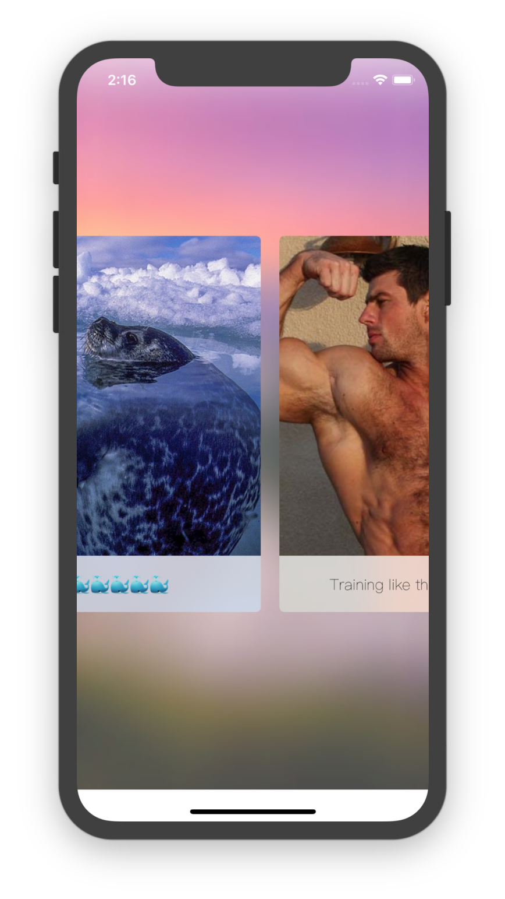

# CarouselEffect-master
## 文件结构
```
.
├── .git
│   ├── HEAD
│   ├── branches
│   ├── config
│   ├── description
│   ├── hooks
│   │   ├── applypatch-msg.sample
│   │   ├── commit-msg.sample
│   │   ├── fsmonitor-watchman.sample
│   │   ├── post-update.sample
│   │   ├── pre-applypatch.sample
│   │   ├── pre-commit.sample
│   │   ├── pre-push.sample
│   │   ├── pre-rebase.sample
│   │   ├── pre-receive.sample
│   │   ├── prepare-commit-msg.sample
│   │   └── update.sample
│   ├── info
│   │   └── exclude
│   ├── objects
│   │   ├── info
│   │   └── pack
│   └── refs
│       ├── heads
│       └── tags
├── Carousel\ Effect
│   ├── .idea
│   │   ├── Carousel\ Effect.iml
│   │   ├── inspectionProfiles
│   │   │   └── profiles_settings.xml
│   │   ├── misc.xml
│   │   ├── modules.xml
│   │   └── workspace.xml
│   ├── AppDelegate.swift
│   ├── Assets.xcassets
│   │   ├── .DS_Store
│   │   ├── AppIcon.appiconset
│   │   │   └── Contents.json
│   │   ├── Contents.json
│   │   ├── blue.imageset
│   │   │   ├── Contents.json
│   │   │   └── blue-1.jpg
│   │   ├── bodyline.imageset
│   │   │   ├── Contents.json
│   │   │   └── bodyline.png
│   │   ├── darkvarder.imageset
│   │   │   ├── Contents.json
│   │   │   └── darkvarder.jpg
│   │   ├── dudu.imageset
│   │   │   ├── Contents.json
│   │   │   └── dudu.jpg
│   │   ├── hello.imageset
│   │   │   ├── Contents.json
│   │   │   └── hello.jpg
│   │   ├── hhhhh.imageset
│   │   │   ├── Contents.json
│   │   │   └── hhhhh.jpg
│   │   ├── run.imageset
│   │   │   ├── Contents.json
│   │   │   └── run.png
│   │   └── wave.imageset
│   │       ├── Contents.json
│   │       └── wave.jpg
│   ├── Base.lproj
│   │   ├── LaunchScreen.storyboard
│   │   └── Main.storyboard
│   ├── HomeViewController.swift
│   ├── Info.plist
│   ├── Interest.swift
│   └── InterestCollectionViewCell.swift
├── Carousel\ Effect.xcodeproj
│   ├── project.pbxproj
│   ├── project.xcworkspace
│   │   ├── contents.xcworkspacedata
│   │   ├── xcshareddata
│   │   │   └── IDEWorkspaceChecks.plist
│   │   └── xcuserdata
│   │       └── lightwingng.xcuserdatad
│   │           └── UserInterfaceState.xcuserstate
│   └── xcuserdata
│       └── lightwingng.xcuserdatad
│           └── xcschemes
│               └── xcschememanagement.plist
└── README.md
```
## 运行截图

